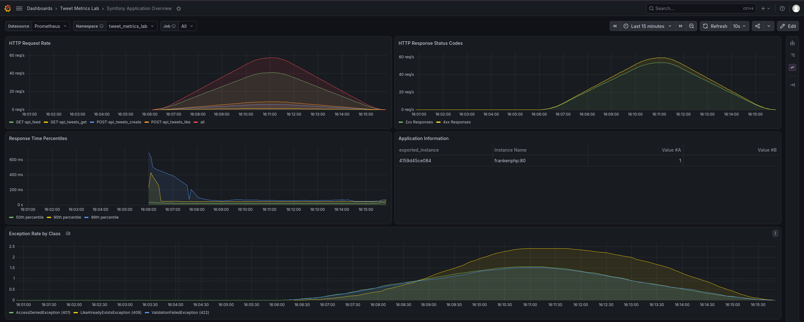

# tweet-metrics-lab

[](https://www.php.net/)
[](https://symfony.com/)
[](https://caddyserver.com/)
[](https://www.postgresql.org/)
[](https://redis.io/)
[](https://www.rabbitmq.com/)
[](https://www.elastic.co/elasticsearch)
[](https://prometheus.io/)
[](https://grafana.com/)
[](https://jwt.io/)
[](https://k6.io/)
[](https://www.docker.com/)

Упрощённый твиттер-клон на Symfony. Главная цель - практика observability
(Prometheus + Grafana) к техническим собеседованиям: RED-метрики HTTP,
доменные счётчики, outbox/очередь, кэш ленты.

Доменная логика намеренно упрощена. Архитектура - лёгкий **DDD + CQRS +
Transactional Outbox**: модули по агрегатам, чистый Domain, Application
(command/query handlers), Infrastructure (API, Doctrine, Messenger).



Дашборд `Symfony Application Overview` под нагрузкой k6: 50 VU, 59 RPS,
p95 41 мс, ноль ответов 5xx. Как повторить - в разделе [Нагрузка](#нагрузка).

## Стек

| Слой          | Технологии                                                             |
|---------------|------------------------------------------------------------------------|
| Runtime       | PHP 8.5, Symfony 7.4, FrankenPHP                                       |
| Данные        | PostgreSQL, Redis, Elasticsearch                                       |
| Асинхронность | RabbitMQ (Symfony Messenger + outbox relay)                            |
| Auth          | JWT (`lexik/jwt-authentication-bundle` + refresh-токены)               |
| Observability | Prometheus, Grafana, artprima metrics bundle, tasko messenger exporter |
| API           | `bulatronic/api-kit` (тонкие контроллеры, единый формат ответов)       |

## Структура каталогов

```
src/
  User/      # регистрация, профиль, JWT login/logout/refresh
  Tweet/     # твиты, лента (feed read-model + Redis cache), projection
  Like/      # лайки / анлайки
  Follow/    # подписки / отписки, списки followers/following
  Search/    # поиск твитов в Elasticsearch
  Shared/    # outbox, метрики, messenger middleware, console-утилиты
docs/
  fixtures.md    # сиды и зачем неравномерное распределение
  load/          # simulate-traffic + k6
docker/
  grafana/       # provisioning datasources/dashboards
  prometheus/    # scrape configs
```

Внутри каждого модуля: `Domain/` → `Application/` → `Infrastructure/`
(зависимости только «вниз», см. `deptrac.yaml`).

## Запуск

```bash
docker compose up -d --build
```

Приложение: http://localhost:8000

Дальше внутри контейнера:

```bash
# миграции
docker compose exec frankenphp php bin/console doctrine:migrations:migrate --no-interaction

# индекс Elasticsearch
docker compose exec frankenphp php bin/console app:elasticsearch:create-index

# фикстуры (400 users / 4000 tweets / ~20k follows / 30k likes)
docker compose exec frankenphp php bin/console doctrine:fixtures:load --no-interaction
```

Подробнее про сиды: [docs/fixtures.md](docs/fixtures.md).

Логин после фикстур: `user_0@example.com` / `password`.

Асинхронность поднимается вместе со стеком (тот же образ, что у `frankenphp`):

| Сервис             | Команда                   | Роль                   |
|--------------------|---------------------------|------------------------|
| `outbox-relay`     | `app:outbox:relay`        | outbox в БД → RabbitMQ |
| `messenger-worker` | `messenger:consume async` | очередь → хендлеры     |

Логи: `docker compose logs -f outbox-relay messenger-worker`.

## Эндпоинты

Auth: `Authorization: Bearer <token>` (кроме публичных).

| Метод    | Путь                        | Auth | Описание                  |
|----------|-----------------------------|------|---------------------------|
| `POST`   | `/api/register`             | нет  | Регистрация               |
| `POST`   | `/api/login`                | нет  | Логин → JWT + refresh     |
| `POST`   | `/api/token/refresh`        | нет  | Обновление access-токена  |
| `POST`   | `/api/logout`               | да   | Logout + blacklist JWT    |
| `GET`    | `/api/me`                   | да   | Текущий пользователь      |
| `GET`    | `/api/users/{id}`           | да   | Профиль пользователя      |
| `GET`    | `/api/users/{id}/tweets`    | да   | Твиты пользователя        |
| `POST`   | `/api/tweets`               | да   | Создать твит              |
| `GET`    | `/api/tweets/{id}`          | да   | Получить твит             |
| `DELETE` | `/api/tweets/{id}`          | да   | Удалить твит              |
| `GET`    | `/api/feed`                 | да   | Лента (cursor pagination) |
| `POST`   | `/api/tweets/{id}/like`     | да   | Лайк                      |
| `DELETE` | `/api/tweets/{id}/like`     | да   | Анлайк                    |
| `POST`   | `/api/users/{id}/follow`    | да   | Подписаться               |
| `DELETE` | `/api/users/{id}/follow`    | да   | Отписаться                |
| `GET`    | `/api/users/{id}/followers` | да   | Фоловеры                  |
| `GET`    | `/api/users/{id}/following` | да   | Подписки                  |
| `GET`    | `/api/search/tweets`        | да   | Поиск твитов (ES)         |
| `GET`    | `/api/doc`                  | нет  | OpenAPI UI                |
| `GET`    | `/metrics/prometheus`       | нет  | Метрики для Prometheus    |

## Метрики

| Сервис      | URL                                      | Доступ            |
|-------------|------------------------------------------|-------------------|
| Prometheus  | http://localhost:9090                    | UI / query        |
| Grafana     | http://localhost:3000                    | `admin` / `admin` |
| App metrics | http://localhost:8000/metrics/prometheus | scrape target     |

Дашборды (провижининг в `docker/grafana/provisioning/`):

| Дашборд                                                    | За что                                                                                                                                                                                 |
|------------------------------------------------------------|----------------------------------------------------------------------------------------------------------------------------------------------------------------------------------------|
| **Symfony Application Overview** (`symfony-overview.json`) | HTTP RED из artprima: rate, status codes, latency, exceptions. Variable **Namespace** = `tweet_metrics_lab`, **Job** = `frankenphp`.                                                   |
| **Business metrics**                                       | Домен: tweets/likes/follows per min, active users, feed cache hit ratio, outbox pending, feed projection lag. Спека: `business-metrics.SPEC.md` → собрать в UI и экспортнуть как JSON. |
| **Queue health**                                           | Messenger (tasko): processed/failed по типу сообщения; RabbitMQ: depth, unacked, consumers. Спека: `queue-health.SPEC.md`.                                                             |

## Нагрузка

Сценарии `app:simulate-traffic` (команды без HTTP) и k6 (HTTP + error rate):

→ [docs/load/README.md](docs/load/README.md)

Имеет смысл смотреть Grafana параллельно с запуском нагрузки.

## Разработка

Перед коммитом:

```bash
docker compose exec frankenphp vendor/bin/php-cs-fixer fix
docker compose exec frankenphp vendor/bin/deptrac analyse
```

Тесты:

```bash
docker compose exec frankenphp bin/phpunit
```
